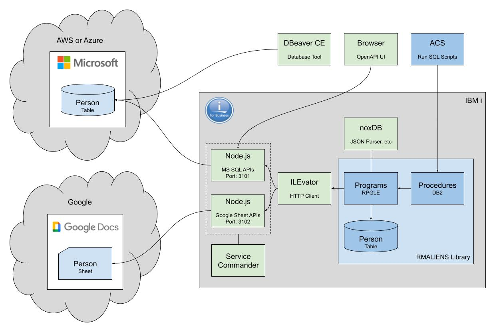
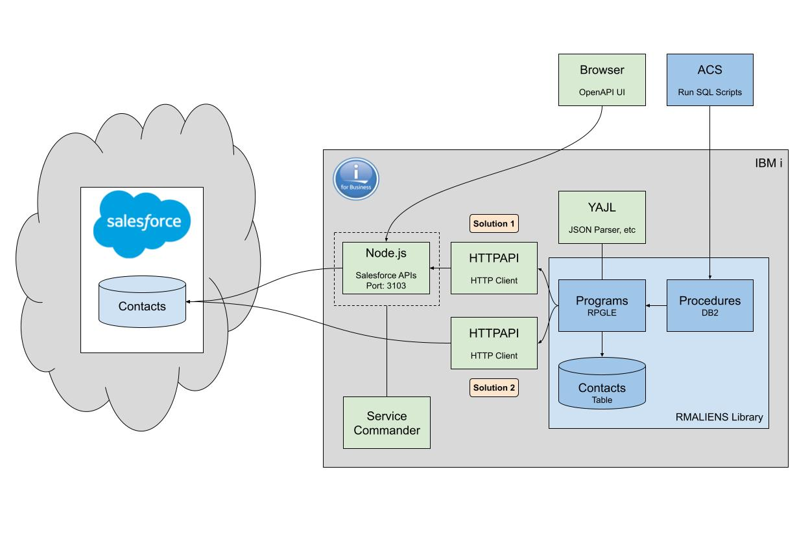

# rmaliens

How do you talk to aliens?

Using open source software, of course!

A set of examples that demonstrate how to access external data on the IBM i from
resources sitting in the cloud.

This project demonstrates three separate examples of accessing external
resources from the IBM i server.

1. Access data held in a Microsoft SQL Server database hosted on either the AWS
or  Azure cloud platforms.
1. Access data held in a Google Docs Sheet hosted on the Google cloud platform.
1. Access data held in the Salesforce CRM platform.

The following open source packages are used.

* Node.js is used for the web servers
    * `express` - Fast, unopinionated, minimalist web framework for Node.js
    * `mssql` - Microsoft SQL Server client for Node.js
    * `google-spreadsheet` - The most popular Google Sheets API wrapper for javascript / typescript
    * `jsforce` - Salesforce API Library for JavaScript applications
* Service Commander to start, stop and manage the web servers
* ILEvator is used as a HTTP client for the ILE environment on IBM i
* noxDB is used to parse the web servers JSON response data
* HTTPAPI is also used as a HTTP client
* YAJL is also used to parse JSON data

## Microsoft SQL Server and Google Sheets Flow



## Salesforce Flow




# Your IBM i

In this project there are lots of references to `myibmi` in this readme. This
is the name of your IBM i. If you add `myibmi` to your hosts file and point it
to your IBM i IP address the instructions and code will work out of the box.


# Installation

## Prerequisites

Install the following OSS packages.

Note that the `yum` command needs to be executed as a user with `*ALLOBJ`
authority.

```shell
ssh my_allobj_user@myibmi
/QOpenSys/pkgs/bin/yum update
/QOpenSys/pkgs/bin/yum install git make-gnu nano nodejs20 service-commander unzip
```

The rest of the instructions assume the user connecting to the IBM i server 
(via SSH) has the `/QOpenSys/pkgs/bin` directory in their path. If not then
ensure you enter the following command after connecting via SSH. You would
need to enter this command each time you connect via SSH.

```shell
export PATH=/QOpenSys/pkgs/bin:$PATH
```

The `/QOpenSys/pkgs/bin` directory is where the OSS pacakges are installed.

## QSYS Object Authority

There is a of QSYS service program that needs to have the `*PUBLIC` authority
changed from `*EXCLUDE` to `*USE`.

```shell
GRTOBJAUT OBJ(QSYS/QSYRGAP1) OBJTYPE(*SRVPGM) USER(*PUBLIC) AUT(*USE)
```

## Create Demo User

Create a new user to use when installing and running the demo.

```shell
CRTJOBD JOBD(RMALIENS)
CRTUSRPRF USRPRF(RMALIENS) PASSWORD(<password>) USRCLS(*PGMR) JOBD(RMALIENS) GRPPRF(QPGMR) OWNER(*GRPPRF) LANGID(ENG) CNTRYID(GB) CCSID(1146) SETJOBATR(*DATFMT) LOCALE('/QSYS.LIB/EN_GB.LOCALE')
CHGOBJOWN OBJ(RMALIENS) OBJTYPE(*JOBD) NEWOWN(RMALIENS)
GRTOBJAUT OBJ(RSTLIB) OBJTYPE(*CMD) USER(RMALIENS) AUT(*USE)
GRTOBJAUT OBJ(RSTOBJ) OBJTYPE(*CMD) USER(RMALIENS) AUT(*USE)
```

Now connect to the IBM i server using the new `RMALIENS` user and set the SSH
environment with the following commands.

```shell
ssh rmaliens@myibmi

# Create the home directory
mkdir -p $HOME

# Change the default shell to Bash
/QOpenSys/pkgs/bin/chsh -s /QOpenSys/pkgs/bin/bash

# Configure the PATH
touch $HOME/.profile
setccsid 1208 $HOME/.profile
echo 'PATH=/QOpenSys/pkgs/bin:$PATH' >> $HOME/.profile
echo 'export PATH' >> $HOME/.profile

# Now exit the SSH session
exit
```

## Third Party OSS Libraries

This demo uses the following OSS libraries.
* ILEVATOR
* LIBHTTP (HTTPAPI)
* NOXDB
* YAJL

If you don't have any of these installed already you can install them using the
official instructions.

* [ILEvator](https://github.com/sitemule/ILEvator)
* [HTTPAPI](https://www.scottklement.com/httpapi)
* [noxDB](https://github.com/sitemule/noxDB)
* [YAJL](https://www.scottklement.com/yajl)

Alternatively you can restore pre-built versions, some from my site.

```shell
ssh rmaliens@myibmi

# ILEvator
curl --output /tmp/ILEVATOR.savf https://rmsoftwareservices.co.uk/savfs/ILEVATOR.savf
system "CRTLIB ILEVATOR TEXT('Sitemule: HTTP client for ILE')"
system "CPYFRMSTMF FROMSTMF('/tmp/ILEVATOR.savf') TOMBR('/QSYS.LIB/QGPL.LIB/ILEVATOR.FILE') MBROPT(*REPLACE) CVTDTA(*NONE)"
system "RSTLIB SAVLIB(ILEVATOR) DEV(*SAVF) SAVF(QGPL/ILEVATOR)"
system "DLTOBJ OBJ(QGPL/ILEVATOR) OBJTYPE(*FILE)"
rm /tmp/ILEVATOR.savf

# noxDB
curl --output /tmp/NOXDB.savf https://rmsoftwareservices.co.uk/savfs/NOXDB.savf
system "CRTLIB NOXDB TEXT('Sitemule: noxDB - Not Only XML')"
system "CPYFRMSTMF FROMSTMF('/tmp/NOXDB.savf') TOMBR('/QSYS.LIB/QGPL.LIB/NOXDB.FILE') MBROPT(*REPLACE) CVTDTA(*NONE)"
system "RSTLIB SAVLIB(NOXDB) DEV(*SAVF) SAVF(QGPL/NOXDB)"
system "DLTOBJ OBJ(QGPL/NOXDB) OBJTYPE(*FILE)"
rm /tmp/NOXDB.savf

# HTTPAPI
curl --output /tmp/HTTPAPI.savf https://www.scottklement.com/httpapi/httpapi.savf
system "CRTLIB LIBHTTP TEXT('Scott Klement HTTP client')"
system "CPYFRMSTMF FROMSTMF('/tmp/HTTPAPI.savf') TOMBR('/QSYS.LIB/QGPL.LIB/HTTPAPI.FILE') MBROPT(*REPLACE) CVTDTA(*NONE)"
system "RSTLIB SAVLIB(LIBHTTP) DEV(*SAVF) SAVF(QGPL/HTTPAPI)"
system "DLTOBJ OBJ(QGPL/HTTPAPI) OBJTYPE(*FILE)"
rm /tmp/HTTPAPI.savf

# YAJL
curl --output /tmp/YAJL.zip https://www.scottklement.com/yajl/YAJL.zip
unzip /tmp/YAJL.zip yajllib72.savf -d /tmp
system "CPYFRMSTMF FROMSTMF('/tmp/yajllib72.savf') TOMBR('/QSYS.LIB/QGPL.LIB/YAJL.FILE') MBROPT(*REPLACE) CVTDTA(*NONE)"
system "CRTLIB YAJL TEXT('Scott Klement YAJL library')"
system "RSTOBJ OBJ(*ALL) SAVLIB(QTEMP) DEV(*SAVF) RSTLIB(YAJL) SAVF(QGPL/YAJL)"
system "DLTOBJ OBJ(QGPL/YAJL) OBJTYPE(*FILE)"
rm /tmp/yajllib72.savf
rm /tmp/YAJL.zip
```

The QICU library is required by ILEvator. The project uses the ICU project
(International Components for Unicode). ICU is available on IBM i in the library
QICU. ILEvator binds to the service program QICU/QXICUUC40.

### DCM *SYSTEM Certificate Store

The Salesforce examples require the use of HTTPS, which means the `*SYSTEM` 
certificate store must exist in DCM and the certificate store files need the 
appropriate authorities for the user running the examples to access. 


## Google

### Authentication

I used the following `google-spreadsheet` guide to enable the necessary Google 
Developers Console, create a project and then generate authentication details.

* [google-spreadsheet Authentication](https://theoephraim.github.io/node-google-spreadsheet/#/guides/authentication)

I suggest using the recommended Service Account authentication method.

The authentication details generated here will be needed when configuring the
Nodej.s Google Sheets web server below.

### People Sheet

It's important that the Google Sheet is called `People` and it should contain a
worksheet called `Characters`. Row 1 should contain two column headings - column
A must be called `firstName` and column B must be called `lastName`.


## Build the RMALIENS Library

If you don't already have a `/prj` directory in the IFS then create and change
the owner to `rmaliens`. The `rmaliens` repo will be cloned into `/prj`.

```shell
ssh my_allobj_user@myibmi
mkdir /prj
system "CHGOWN OBJ('/prj') NEWOWN(RMALIENS)"
```

Now, clone the `rmaliens` repository on your IBM i server.

```shell
ssh rmaliens@myibmi
cd /prj
git clone https://github.com/richardm90/rmaliens.git
```

The repository has now been installed to the IFS in directory `/prj/rmaliens`.

Now, let's build the project.

```shell
cd /prj/rmaliens
make
```

## Install Node.js Packages

Install Node.js packages for `rmaliens` the web servers.

```shell
cd /prj/rmaliens/cloud_mssql/apis
npm install

cd /prj/rmaliens/google_sheets/apis
npm install

cd /prj/rmaliens/salesforce/apis
npm install
```

## Configuration

Update the `RMALIENS` job description to include the application and third party libraries.

```shell
CHGJOBD JOBD(RMALIENS) INLLIBL(RMALIENS ILEVATOR NOXDB LIBHTTP YAJL QGPL QTEMP)
```

Create the environment variable configuration files.

The first file you need to create defines the MS SQL server configuration, I
am showing two sample configurations here. One for Azure and one for AWS.

```shell
# Azure sample configuration
# /prj/rmaliens/cloud_mssql/apis/.env.development
PORT=3101
DB_SERVER="rmaliens.database.windows.net"
DB_DATABASE="rmaliens"
DB_PORT=1433
DB_USER="<mssql_user>"
DB_PASSWORD="<mssql_password>"
```

```shell
# AWS sample configuration
# /prj/rmaliens/cloud_mssql/apis/.env.development
PORT=3101
DB_SERVER="rmaliens.<aws_db_id>.eu-west-2.rds.amazonaws.com"
DB_DATABASE="rmaliens"
DB_PORT=1433
DB_USER="<mssql_user>"
DB_PASSWORD="<mssql_password>"
```

Using the [Google Authentication](#google-authentication) details created above.

```shell
# /prj/rmaliens/google_sheets/apis/.env.development
PORT=3102
GOOGLE_DOC_ID="<google_doc_id>"
GOOGLE_SHEET_TITLE="Characters"
GOOGLE_SERVICE_ACCOUNT_EMAIL="<google_service_account_email>"
GOOGLE_PRIVATE_KEY="<google_priveate_key>"
```

The third file contains your Salesforce credentials.

```shell
# /prj/rmaliens/salesforce/apis/.env.development
PORT=3103
SF_LOGIN_URL="<sf_login_url>"
SF_USERNAME="<sf_username>"
SF_PASSWORD="<sf_password>"
```


## Start the Web Servers

Manage the web servers using Service Commander.

**Note** that if Service Commander complains (e.g. Unhandled exception) when 
trying to start a service you may need to update the `openjdk` package.

```shell
ssh rmaliens@myibmi

# Start the services
sc start /prj/rmaliens/sc/mssqlapis.yaml
sc start /prj/rmaliens/sc/sheetapis.yaml
sc start /prj/rmaliens/sc/salesforce.yaml

# Restart the services
sc restart /prj/rmaliens/sc/mssqlapis.yaml
sc restart /prj/rmaliens/sc/sheetapis.yaml
sc restart /prj/rmaliens/sc/salesforce.yaml

# Stop the services
sc stop /prj/rmaliens/sc/mssqlapis.yaml
sc stop /prj/rmaliens/sc/sheetapis.yaml
sc stop /prj/rmaliens/sc/salesforce.yaml

# Check the current status
sc status /prj/rmaliens/sc/mssqlapis.yaml
sc status /prj/rmaliens/sc/sheetapis.yaml
sc status /prj/rmaliens/sc/salesforce.yaml
```
