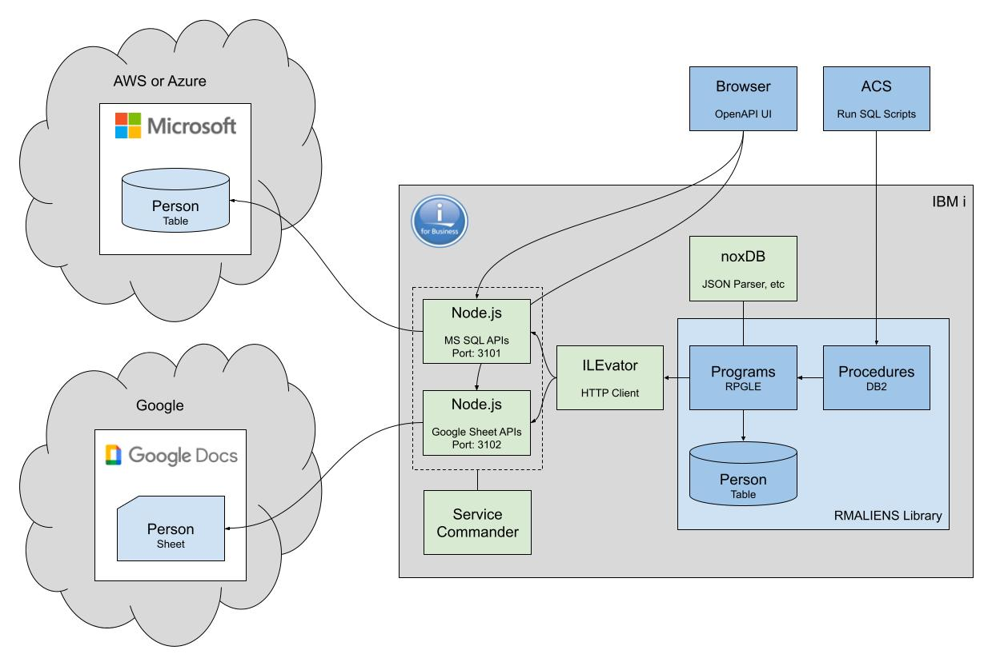

# rmaliens

How do you talk to aliens?

Using open source software, of course!

A set of examples that demonstrate how to access external data on the IBM i from
resources sitting in the cloud.

This project demonstrates two separate examples of accessing external resources
from the IBM i server.

1. Access data held in a Microsoft SQL Server database hosted on either the AWS
or  Azure cloud platforms.
1. Access data held in a Google Docs Sheet hosted on the Google cloud platform.



The following open source packages are used.

* Node.js is used for the web servers
    * `express` - Fast, unopinionated, minimalist web framework for Node.js
    * `mssql` - Microsoft SQL Server client for Node.js
    * `google-spreadsheet` - The most popular Google Sheets API wrapper for javascript / typescript
* Service Commander to start, stop and manage the web servers
* ILEvator is used as a HTTP client for the ILE environment on IBM i
* noxDB is used to parse the web servers JSON response data

# TODO

* Update to the latest versions of ILEvator and noxDB

## Notes

* The Google Sheets API impose quotas for read requests per minute
    * [Google Sheets API Usage Limits](https://developers.google.com/sheets/api/limits)


# Your IBM i

In this project there are lots of references to `my_ibm_i` both in this readme
and witin the code. This is the name of your IBM i. If you add `my_ibm_i` to
your hosts file and point it to your IBM i IP address the instructions and code
will work out of the box.


## Prerequisites

Install the following OSS packages.

Note that the `yum` command needs to be executed as a user with `*ALLOBJ`
authority.

```shell
ssh my_allobj_user@my_ibm_i
/QOpenSys/pkgs/bin/yum install git make-gnu nano nodejs18 service-commander
```

These instructions assume that user connecting to the IBM i server 
(via SSH) has the `/QOpenSys/pkgs/bin` directory in your path. If not
then ensure you enter the following command after connectint via SSH. You
need to enter this command each time you connect via SSH.

```shell
export PATH=/QOpenSys/pkgs/bin:$PATH
```

The `/QOpenSys/pkgs/bin` directory is where the OSS pacakges are installed.

### QSYS Object Authority

There is a of QSYS service program that needs to have the `*PUBLIC` authority
changed from `*EXCLUDE` to `*USE`.

```shell
GRTOBJAUT OBJ(QSYS/QSYRGAP1) OBJTYPE(*SRVPGM) USER(*PUBLIC) AUT(*USE)
```

### Create Demo User

Create a new user to use when installing and running the demo.

```shell
CRTJOBD JOBD(RMALIENS)
CRTUSRPRF USRPRF(RMALIENS) PASSWORD(<password>) USRCLS(*PGMR) JOBD(RMALIENS) GRPPRF(QPGMR) OWNER(*GRPPRF) LANGID(ENG) CNTRYID(GB) CCSID(1146) SETJOBATR(*DATFMT) LOCALE('/QSYS.LIB/EN_GB.LOCALE')
CHGOBJOWN OBJ(RMALIENS) OBJTYPE(*JOBD) NEWOWN(RMALIENS)
GRTOBJAUT OBJ(RSTLIB) OBJTYPE(*CMD) USER(RMALIENS) AUT(*USE)
```

Now connect to the IBM i server using the new `RMALIENS` user and set the SSH
environment with the following commands.

```shell
ssh rmaliens@my_ibm_i

# Create the home directory
mkdir -p $HOME

# Change the default shell to Bash
/QOpenSys/pkgs/bin/chsh -s /QOpenSys/pkgs/bin/bash

# Configure the PATH
touch $HOME/.profile
setccsid 1208 $HOME/.profile
echo 'PATH=/QOpenSys/pkgs/bin:$PATH' >> $HOME/.profile
echo 'export PATH' >> $HOME/.profile

# Now exit the SSH session
exit
```

### Third Party OSS Libraries

This demo uses the following OSS libraries.
* ILEVATOR
* NOXDB
* RMTOOLS

If you don't have any of these installed already then install them with the 
following commands.

```shell
ssh rmaliens@my_ibm_i

# ILEvator
curl --output /tmp/ILEVATOR.savf https://rmsoftwareservices.co.uk/savfs/ILEVATOR.savf
system "CRTLIB ILEVATOR TEXT('Sitemule: noxDB - Not Only XML')"
system "CPYFRMSTMF FROMSTMF('/tmp/ILEVATOR.savf') TOMBR('/QSYS.LIB/QGPL.LIB/ILEVATOR.FILE') MBROPT(*REPLACE) CVTDTA(*NONE)"
system "RSTLIB SAVLIB(ILEVATOR) DEV(*SAVF) SAVF(QGPL/ILEVATOR)"
system "DLTOBJ OBJ(QGPL/ILEVATOR) OBJTYPE(*FILE)"
rm /tmp/ILEVATOR.savf

# noxDB
curl --output /tmp/NOXDB.savf https://rmsoftwareservices.co.uk/savfs/NOXDB.savf
system "CRTLIB NOXDB TEXT('Sitemule: noxDB - Not Only XML')"
system "CPYFRMSTMF FROMSTMF('/tmp/NOXDB.savf') TOMBR('/QSYS.LIB/QGPL.LIB/NOXDB.FILE') MBROPT(*REPLACE) CVTDTA(*NONE)"
system "RSTLIB SAVLIB(NOXDB) DEV(*SAVF) SAVF(QGPL/NOXDB)"
system "DLTOBJ OBJ(QGPL/NOXDB) OBJTYPE(*FILE)"
rm /tmp/NOXDB.savf

# RMTOOLS
curl --output /tmp/RMTOOLS.savf https://rmsoftwareservices.co.uk/savfs/RMTOOLS.savf
system "CRTLIB RMTOOLS TEXT('RM Software Services Tools v1.0.8')"
system "CPYFRMSTMF FROMSTMF('/tmp/RMTOOLS.savf') TOMBR('/QSYS.LIB/QGPL.LIB/RMTOOLS.FILE') MBROPT(*REPLACE) CVTDTA(*NONE)"
system "RSTLIB SAVLIB(RMTOOLS) DEV(*SAVF) SAVF(QGPL/RMTOOLS)"
system "DLTOBJ OBJ(QGPL/RMTOOLS) OBJTYPE(*FILE)"
rm /tmp/RMTOOLS.savf
```

The QICU library is required by ILEvator. The project uses the ICU project
(International Components for Unicode). ICU is available on IBM i in the library
QICU. ILEvator binds to the service program QICU/QXICUUC40.

### Google

#### Authentication

I used the following `google-spreadsheet` guide to enable the necessary Google 
Developers Console, create a project and then generate authentication details.

* [google-spreadsheet Authentication](https://theoephraim.github.io/node-google-spreadsheet/#/guides/authentication)

I suggest using the recommended Service Account authentication method.

The authentication details generated here will be needed when configuring the
Nodej.s Google Sheets web server below.

#### Persons Sheet

It's important that the Google Sheet is called `Persons` and it should contain a
worksheet called `Characters`.


## Installation

First, install the `rmaliens` repository to your IBM i server.

```shell
ssh rmaliens@my_ibm_i
mkdir /prj
cd /prj
git clone https://richardm90@bitbucket.org/richardm90/rmaliens.git
```

The repository has now been installed to the IFS in directory `/prj/rmaliens`.

Before building the project you need to update a couple of source files with 
the correct IP address and port for your IBM i server.

* Update the IP address and port number in the `BASE_URL` constant in source
file `/prj/rmaliens/cloud_mssql/src/person_d.rpgleinc`
* Update the IP address and port number in the `HTTP_GET` statement in source
file `/prj/rmaliens/cloud_mssql/sql/mssql_demo.sql`

Now, let's build the project.

```shell
cd /prj/rmaliens
gmake
```

Install Node.js packages on the web server.

```shell
cd /prj/rmaliens/cloud_mssql/apis
npm install

cd /prj/rmaliens/google_sheets/apis
npm install
```

## Configuration

Update the `RMALIENS` job description to include the application and third party libraries.

```shell
CHGJOBD JOBD(RMALIENS) INLLIBL(RMALIENS ILEVATOR NOXDB QGPL QTEMP)
```

Create the environment variable configuration files.

```shell
# /prj/rmaliens/cloud_mssql/apis/.env.development
PORT=3101
DB_SERVER="rmaliens.database.windows.net"
DB_DATABASE="rmaliens"
DB_PORT=1433
DB_USER="<mssql_user>"
DB_PASSWORD="<mssql_password>"
```

Using the [Google Authentication](#google-authentication) details created above.

```shell
# /prj/rmaliens/google_sheets/apis/.env.development
PORT=3102
GOOGLE_DOC_ID="<google_doc_id>"
GOOGLE_SHEET_TITLE="ModernFamily"
GOOGLE_SERVICE_ACCOUNT_EMAIL="<google_service_account_email>"
GOOGLE_PRIVATE_KEY="<google_priveate_key>"
```

## Start the Web Servers

Manage the web servers using Service Commander.

```shell
ssh rmaliens@my_ibm_i

# Start the services
sc start /prj/rmaliens/cloud_mssql/sc/mssqlapis.yaml
sc start /prj/rmaliens/cloud_mssql/sc/sheetapis.yaml

# Restart the services
sc restart /prj/rmaliens/cloud_mssql/sc/mssqlapis.yaml
sc restart /prj/rmaliens/cloud_mssql/sc/sheetapis.yaml

# Stop the services
sc stop /prj/rmaliens/cloud_mssql/sc/mssqlapis.yaml
sc stop /prj/rmaliens/cloud_mssql/sc/sheetapis.yaml

# Check the current status
sc status /prj/rmaliens/cloud_mssql/sc/mssqlapis.yaml
sc status /prj/rmaliens/cloud_mssql/sc/sheetapis.yaml
```
